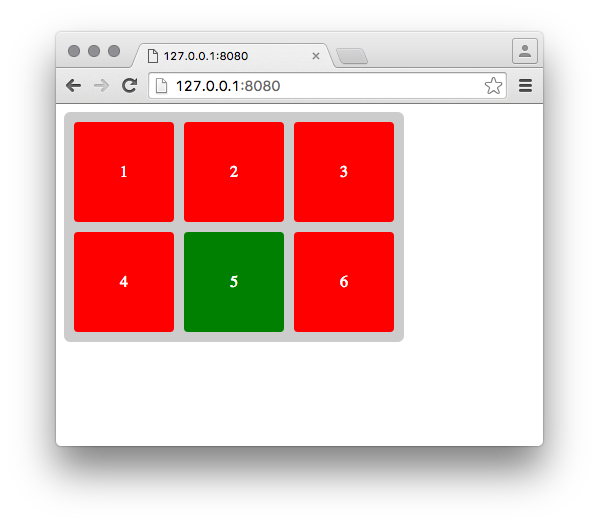

# Pixformance Front End Coding Test

Hello, thanks for taking the time to apply and complete our coding test. The
test is comprised of five simple tasks, each designed to see how you approach
tasks that often arise at Pixformance. There are no riddles or trick questions
here, we just want to see how you work.

The test is designed to take two hours to complete, if you take longer don't
worry, but this extra time will be taken into account when assessing
your completed test. You do not have to complete the tasks in order, and if you
run out of time it is fine to submit an incomplete test.

##### Rules

1. You can use anything that is available in the current version of Chrome /
   Node, do not worry about cross-browser or backwards compatibility.
2. You are allowed to use any libraries you wish; if you do, your choice will be
   taken into account.
3. Googling is fine, please work as you normally would.
4. Please write comments where appropriate.

The tests involve you completing already started mini projects, each one in
it's own self-contained folder.

Good luck and have fun.

## Task One

There is a `tidyArray` function in `one/index.js`. This function will take an
array of strings, and return a new array of tidied strings. Please complete the
`tidyArray` function, it needs to do two things:

1. Remove duplicates from an array.
2. Sort the array alphabetically.

A test array has been provided, but please make sure it works with any array of
strings.

## Task Two

There are two functions in `two/index.js`: `add` and `add2`. In the file
`two/test.js` please write unit tests for these two functions. A basic test
harness has been provided, you can run the tests with `npm test`.

## Task Three

There is some markup in `three/index.html`. Without touching the HTML,
add CSS to `three/index.css` so the page looks like this:

###### Requirements
1. The paragraph element should have a grey background.
2. Span elements should be displayed in two rows of three columns.
3. Span elements should be 100px square.
4. Span elements should be red.
5. The fifth span element should be green.
6. The numbers inside the spans should be white.
7. The numbers inside the spans should be vertically and horizontally centered.
8. All spans should have 10px between the container edge and adjacent spans.

## Task Four

There is some basic HTML and CSS for a button. Using whatever methods you wish,
create an 'error' animation when the button is clicked.

When clicked, the button should:

1. Turn red.
2. Shake.
3. Return to it's original state.

## Task Five

There is a simple node server in `five/server.js`, it can be started with
`npm start`.

The server has just one route `/get-next-word`. Each time this route is called
the server will return one word, in order, from the famous Descartes quote:

> I think therefore I am.

For instance the first request made to `/get-next-word` will return `I`, the
second request will return `think`, the third `therefore`, and so on.

Your task is to make five requests to `/get-next-word`, and when they have all
returned, join them all together and print the result to the console.

The server has been designed to mimic latency, so each response will have a
random delay of 0-1 second.

###### Requirements
1. Do not modify the server.js file.
2. Please make good use of concurrency in your answer.

